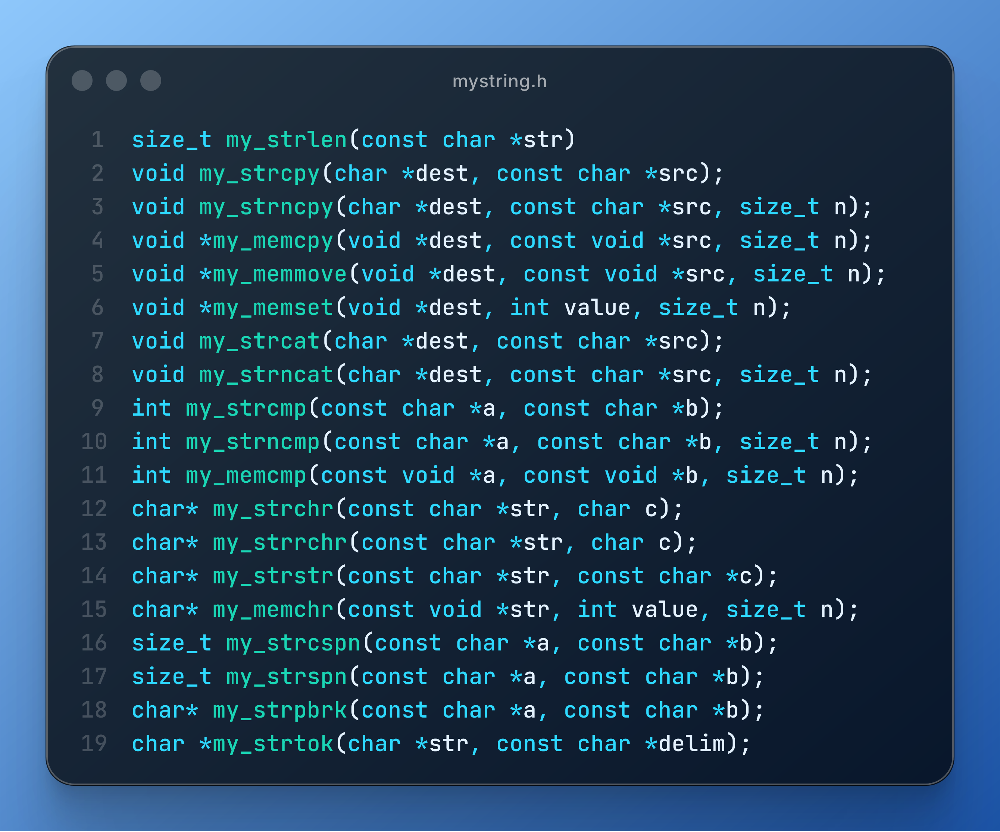

# mystring

A from-scratch reimplementation of `<string.h>` in raw C — no standard library
includes, not even for `NULL` (it's defined by hand in `mystring.h`). The
goal is to rebuild the mental model behind each function, not just match its
behavior.

## Files

- `mystring.h` — header guard, the manual `NULL` definition, and prototypes
  for all 19 functions.
- `mystring.c` — the implementations, `#include`-ing `mystring.h`.



## Progress

**19 of 19** implementable functions from the ISO C `<string.h>` header are
done. Excluded on purpose: `strcoll`, `strxfrm`, `strerror` — they're
locale/errno-dependent and don't really fit this kind of exercise.

Implemented: `strlen`, `strcpy`, `strncpy`, `strcat`, `strncat`, `strcmp`,
`strncmp`, `strchr`, `strrchr`, `strstr`, `strcspn`, `strspn`, `strpbrk`,
`strtok`, `memcpy`, `memmove`, `memcmp`, `memchr`, `memset`

## Setup

```c
#ifndef NULL
#define NULL 0
#endif
```

Since no headers are included, `NULL` isn't available from `<stddef.h>` —
it's defined manually as a plain `0`, which is a valid null pointer constant
in C. This lives in `mystring.h`, guarded with `#ifndef` in case the
compiler's toolchain already predefines `NULL` (some do, which caused a
macro-redefinition warning before the guard was added).

## Implemented functions

### `int my_strlen(char *str)`

**Concept:** measure how many characters are in a string before its
terminator, so other functions (and the caller) know where the usable data
ends.

Walks the string one index at a time until it hits `'\0'`, and returns how
far it got — that index *is* the length, since indices are zero-based.

```c
int my_strlen(char *str) {
  int i;
  for (i = 0; str[i] != '\0'; i++) {
    if (str[i] == '\0') {
      break;
    }
  }
  return i;
}
```

### `void my_strcpy(char *dest, char *src)`

**Concept:** duplicate the contents of one string into another buffer,
with no length limit — the caller is trusted to have made `dest` big
enough.

Copies `src` into `dest` character by character until it hits `src`'s
terminator, then writes a `'\0'` into `dest` at that same position. Unlike
`strncpy`, there's no bound on how many characters get copied.

### `void my_strncat(char *dest, char *src, int n)`

**Concept:** grow an existing string by tacking up to `n` characters from
another string onto its end — a bounded version of concatenation, used
when `dest`'s buffer size is known and must not be exceeded.

Two indices are used for a reason: `i` starts at `my_strlen(dest)` (where
writing should begin) and tracks the absolute position in `dest`; `j`
starts at `0` and counts how many characters have been copied *from
`src`* — the loop bound (`j != n`) has to be checked against the count
copied, not against `i`, otherwise `dest`'s existing length would eat into
the budget meant for `src`. Unlike `strncpy`, `strncat` **always**
null-terminates the result unconditionally after the loop, regardless of
whether the `n` limit was hit.

```c
void my_strncat(char *dest, char *src, int n) {
  int i = my_strlen(dest);
  int j = 0;
  while (src[j] != '\0' && j != n) {
    dest[i] = src[j];
    i++;
    j++;
  }
  dest[i] = '\0';
}
```

### `int my_strcmp(char *a, char *b)`

**Concept:** determine ordering/equality between two strings without
knowing their lengths in advance — used anywhere strings need to be
compared, sorted, or checked for equality (C has no `==` for strings).

Returns `0` if equal, a negative value if `a` sorts before `b`, positive if
`a` sorts after `b` (mirroring the real `strcmp` contract — the exact
magnitude isn't meaningful, just the sign). Walks both strings in lockstep
until either a mismatch is found or one of them terminates, then compares
whatever characters (including a possible `'\0'`) are sitting at the final
index.

### `int my_strncmp(char *a, char *b, int n)`

**Concept:** the same ordering/equality check as `strcmp`, but limited to
comparing only the first `n` characters — useful for checking a prefix
(e.g. "does this string start with 'http'") without caring what follows.

Same lockstep walk as `my_strcmp`, but stops after at most `n` characters
— if the first `n` characters are identical (or `n` is reached before a
terminator), the strings are considered equal regardless of what comes
after.

### `char *my_strchr(char *str, char c)`

**Concept:** find *where* a specific character first appears in a string,
returning a pointer into the string itself (not a copy) so the caller can
read from or act on that exact position onward.

Returns a pointer to the **first** occurrence of `c` in `str`, or `NULL`
if it isn't found. The loop condition checks `str[i] != '\0'` as well as
`str[i] != c` so the search stops at the end of the string instead of
reading past it — and because the terminator itself is included in the
scan, searching for `c == '\0'` correctly returns a pointer to it (matching
real `strchr` semantics).

```c
char *my_strchr(char *str, char c) {
  int i = 0;
  while (str[i] != c && str[i] != '\0') {
    i++;
  }
  if (str[i] == c) {
    return &str[i];
  }
  return NULL;
}
```

### `char *my_strrchr(char *str, char c)`

**Concept:** same search as `strchr`, but for the **last** occurrence
instead of the first — useful for things like finding the final `/` in a
file path or the final `.` before a file extension.

Rather than scanning forward and returning as soon as a match is found, it
starts at the terminator (`my_strlen(str)`) and walks *backward*, so the
first match it hits scanning in that direction is actually the last one in
the string. The loop's stopping condition is index-based (`i >= 0`), not
based on comparing character values — an earlier version of this function
mistakenly stopped when it saw a character equal to `str[0]`'s *value*,
which could halt the scan early if that character happened to reappear
elsewhere in the string, before ever reaching index `0`.

```c
char* my_strrchr(char *str, char c) {
  int i = my_strlen(str);
  while (i >= 0 && str[i] != c) {
    i--;
  }
  if (i >= 0) {
    return &str[i];
  }
  return NULL;
}
```

### `char *my_strstr(char *str, char *c)`

**Concept:** find *where* an entire substring (not just one character)
first appears inside a larger string — the natural extension of `strchr`
from single characters to whole patterns.

Returns a pointer to the first occurrence of `c` inside `str`, or `NULL`
if `c` never appears. Naive `O(n*m)` approach: for every starting index
`i` in `str`, try to match all of `c` starting there. `n` is reset to `0`
at the top of *every* outer-loop iteration — each candidate start position
gets a fresh comparison against `c` from its beginning. A match is only
reported once the inner `while` walks all the way to `c`'s terminator
(`c[n] == '\0'`); reaching the end of `str` instead just means that
candidate failed, and the search moves on to the next `i`. If `c` is an
empty string, the inner loop never runs, `n` stays `0`, and `c[0] == '\0'`
is immediately true — so it correctly returns `str` itself on the very
first try, matching real `strstr` behavior for an empty needle.

```c
char* my_strstr(char *str, char *c) {
  int size = my_strlen(str);
  for (int i = 0; i < size; i++) {
    int n = 0;
    while (str[i + n] == c[n] && str[i + n] != '\0' && c[n] != '\0') {
      n++;
    }
    if (c[n] == '\0') {
      return &str[i];
    }
  }
  return NULL;
}
```

### `void my_strncpy(char *dest, char *src, int n)`

**Concept:** copy a string into a fixed-size buffer without ever writing
more than `n` characters into it — a bounded version of `strcpy`, meant to
avoid overflowing `dest` when `src`'s length isn't trusted or known ahead
of time.

Copies at most `n` characters from `src` into `dest`. If `src` is shorter
than `n`, the copy stops early (`i < strlen(src)`) and a terminator is
written right after the copied characters. If `src` is `n` characters or
longer, the loop stops with `i == n`, and — matching real `strncpy`'s
(in)famous behavior — **no terminator is written** in that case, since
`dest[n]` may be one byte past the end of a buffer sized to hold exactly
`n` bytes. The `if (i < n)` guard around the terminator write is what
prevents that out-of-bounds write.

```c
void my_strncpy(char *dest, char *src, int n) {
  int i = 0;
  while (src[i] != '\0' && i != n) {
    dest[i] = src[i];
    i++;
  }
  if (i < n) {
    dest[i] = '\0';
  }
}
```

### `void *my_memcpy(void *dest, void *src, int n)`

**Concept:** copy a fixed number of raw *bytes* from one memory location
to another, with no assumption that the data represents a C-string at all
— the general-purpose primitive underneath most of the `str*` copy
functions, usable on any data type (arrays, structs, binary buffers).

Copies exactly `n` bytes from `src` to `dest`, with no awareness of `'\0'`
at all — this is the first function here that isn't operating on
C-strings. The parameters are `void *` because `memcpy` doesn't assume
anything about the type of data being copied. Since `void *` can't be
indexed directly, the parameters are immediately assigned to local
`char *` variables (`x`, `y`) so the copy can happen one byte at a time.
Doesn't handle overlapping `src`/`dest` regions safely — that's what
`memmove` is for.

```c
void *my_memcpy(void *dest, void *src, int n) {
  int i = 0;
  char *x = dest;
  char *y = src;

  while (i < n) {
    x[i] = y[i];
    i++;
  }
  return x;
}
```

### `void *my_memmove(void *dest, void *src, int n)`

**Concept:** the same raw-byte copy as `memcpy`, but safe when `src` and
`dest` overlap in memory. A naive forward byte-by-byte copy can overwrite
part of `src` before it's been read, if the two regions overlap — `memmove`
has to detect the overlap direction and, when necessary, copy backward
(from the end toward the start) instead of always copying forward from
index `0`.

Compares the `dest` and `src` pointers directly to pick a direction. If
`dest` starts before `src` (`x < y`), copying forward from index `0` is
safe — each byte of `dest` written is always behind the `src` read
position, so nothing gets clobbered before it's read. If `dest` starts
after `src` (`x > y`), forward copying would overwrite the tail of `src`
before reaching it, so the loop instead runs backward from `n - 1` down to
`0`. If the two pointers are equal, neither branch runs — copying a region
onto itself is a no-op.

```c
void *my_memmove(void *dest, void *src, int n) {
  char *x = dest;
  char *y = src;

  if ( x < y ) {
    int i = 0;
    while( i < n ) {
      x[i] = y[i];
      i++;
    }
  }
  if ( x > y ) {
    int i = n - 1;
    while( i >= 0 ) {
      x[i] = y[i];
      i--;
    }
  }
  return x;
}
```

### `int my_memcmp(void *a, void *b, int n)`

**Concept:** compare two raw memory regions byte by byte, the `mem*`
counterpart to `strcmp` — used when comparing data that isn't necessarily
null-terminated text (e.g. binary buffers, structs), or when embedded
`'\0'` bytes in the middle of the data shouldn't stop the comparison early.

Same lockstep-comparison shape as `my_strncmp`, but with no `'\0'` check in
the loop condition at all — it always walks exactly `n` bytes regardless of
what values it finds, which is the whole point versus `strcmp`.

### `char *my_memchr(void *str, int value, int n)`

**Concept:** the `mem*` counterpart to `strchr` — find a byte's first
occurrence within a fixed-length block of memory, rather than searching
until a `'\0'` terminator. Useful for scanning binary data that may
contain `'\0'` bytes that aren't meant to signal "end of data."

Scans exactly `n` bytes with a bounded `for` loop (no terminator check),
returning a pointer to the first byte equal to `value`, or `NULL` if the
whole block is scanned without a match.

### `void *my_memset(void *dest, int value, int n)`

**Concept:** fill a block of memory with a single repeated byte value —
commonly used to zero out or initialize a buffer before use (e.g. clearing
a `struct` or an array to a known state).

Straightforward bounded loop: casts `dest` to `char *` and writes `value`
into each of the `n` bytes. `value` is declared `int` (matching the real
`memset` signature) but every write truncates it to a single byte, same as
the standard function.

### `int my_strspn(char *a, char *b)`

**Concept:** measure how many *leading* characters of a string belong to a
given set of "accepted" characters — answers "how long is the prefix made
entirely of these characters?" (e.g. skipping leading whitespace or
digits).

For each character of `a`, an inner loop checks it against every character
of `b`, setting a `found` flag if there's a match. As soon as a character
of `a` isn't found anywhere in `b`, that index is returned — it marks the
end of the accepted-character prefix. If the whole of `a` matches, the
loop finishes and `my_strlen(a)` is returned (the entire string is the
prefix).

### `int my_strcspn(char *a, char *b)`

**Concept:** the inverse of `strspn` — measure how many leading characters
of a string do *not* belong to a given set of "reject" characters, i.e.
find the position of the first character that *is* in the set.

Same double-loop shape as `strspn`, but inverted: it returns immediately
the moment a character of `a` matches *any* character of `b`, since that's
the first "rejected" character. If no character of `a` ever matches
anything in `b`, the loop runs to completion and `my_strlen(a)` is
returned.

### `char *my_strpbrk(char *a, char *b)`

**Concept:** find the first occurrence in a string of *any* character from
a given set — like `strchr`, but searching for one of several possible
characters at once instead of just one.

Structurally identical to `strcspn`'s double loop, but returns a pointer
(`&a[i]`) into `a` at the match instead of an index, and returns `NULL`
instead of a length when nothing in `b` is ever found.

### `char *my_strtok(char *str, char *delim)`

**Concept:** split a string into a sequence of tokens separated by a set
of delimiter characters, returning one token per call. The trickiest
function here, because it has to remember *where it left off* between
calls — real `strtok` does this with a hidden `static` pointer that
persists across invocations, which also makes it not thread-safe and
unable to tokenize two strings at once.

`pos` is that hidden static pointer. Passing `NULL` as `str` tells the
function to resume from `pos` instead of starting a fresh string — this is
what makes repeated `my_strtok(NULL, delim)` calls work. If there's
nowhere left to resume from (`pos` is `NULL`, or resuming lands right on a
terminator), it reports "no more tokens" by returning `NULL`. Otherwise it
scans forward for the first character that matches anything in `delim`:
when found, that position is overwritten with `'\0'` to end the current
token, `pos` is set to the character *just after* it so the next call
picks up there, and a pointer to the start of the token (`str`) is
returned. If the scan reaches the end of `str` without ever finding a
delimiter, the remaining text is itself the final token — it's returned
directly, and `pos` is reset to `NULL` so the following call correctly
signals the end.

```c
char *my_strtok(char *str, char *delim) {
  static char *pos = NULL;
  int i = 0;
  int j = 0;

  if ( str == NULL ) {
    str = pos;
  }

  if ( str == NULL || str[0] == '\0' ) {
    return NULL;
  }

  for ( i ; i < my_strlen(str) ; i++) {
    for ( j  = 0; j < my_strlen(delim) ; j++) {
      if ( str[i] == delim[j] ) {
        str[i] = '\0';
        pos = &str[i + 1];
        return str;
      }
    }
  }
  pos = NULL;
  return str;
}
```
