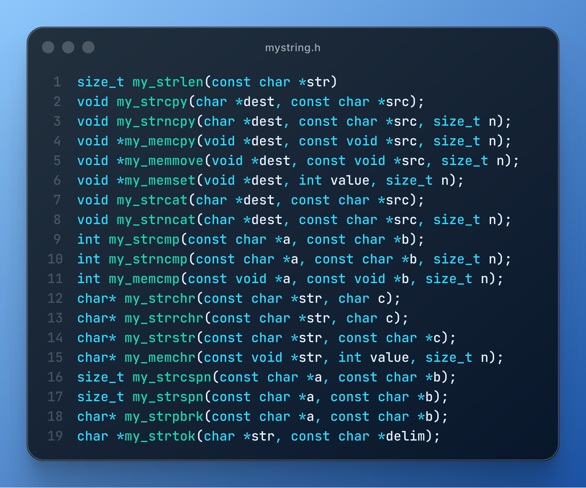

# mystring

A from-scratch reimplementation of `<string.h>` in raw C, no standard library
included . The goal is to rebuild the mental model behind each function, not just match its
behavior.

## Files

- `mystring.h` — header guard, the manual `NULL` definition, and prototypes
  for all 19 functions.
- `mystring.c` — the implementations, `#include`-ing `mystring.h`.



## Setup

```c
#ifndef NULL
#define NULL 0
#endif
```

Since no headers are included, `NULL` isn't available from `<stddef.h>` —
it's defined manually as a plain `0`, which is a valid null pointer constant
in C. This lives in `mystring.h`, guarded with `#ifndef` in case the
compiler's toolchain already predefines `NULL` (some do, which caused a
macro-redefinition warning before the guard was added).
